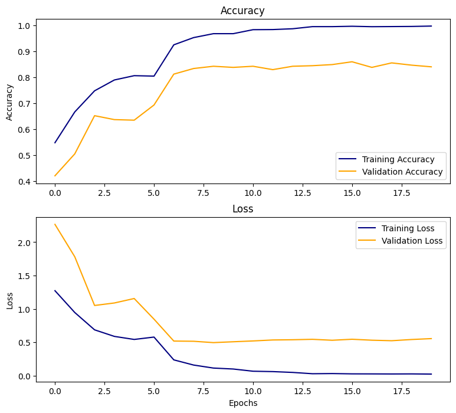
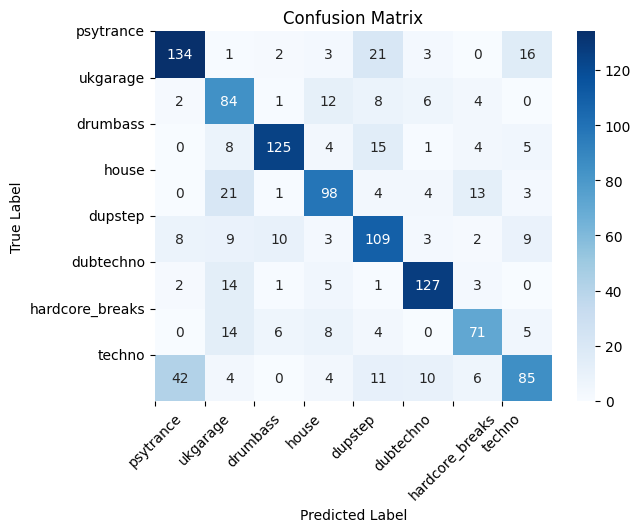

# EDM Music Classificator

<p align='center'>
<a href="https://img.shields.io/badge/-pytorch-lightgray?logo=pytorch"></a>
<a href="https://img.shields.io/badge/-torchaudio-yellow?logo=pytorch"></a>
<a href="https://img.shields.io/badge/-torchvision-blue?logo=pytorch"></a>
</p>


Music classificator for main EDM genres made with pytorch.

## How to use

Clone the repo:

```
git clone https://github.com/jvaleroliet/music_classificator.git
```

## Process

### 1. Data Collection

We choosed random playlist for the genres from spotify, but the quality of this selections can be not so good. The first jupyter will then download the songs and generate this structure:


``` 
songs/
├── psytrance/
│   ├── preview_1.mp3
│   ├── preview_2.mp3
│   └── ...
├── house/
│   ├── preview_1.mp3
│   ├── preview_2.mp3
│   └── ...
├── dubstep/
│   ├── preview_1.mp3
│   ├── preview_2.mp3
│   └── ...
├── hardcore_breaks/
│   ├── preview_1.mp3
│   ├── preview_2.mp3
│   └── ...
└── techno/
    ├── preview_1.mp3
    ├── preview_2.mp3
    └── ...
```

You need a [spotify api](https://developer.spotify.com/documentation/web-api) secret and client. 

You can try with your own data if you structure the folders like this and go directly to the second notebook.

### Data Preprocessing

After the songs are downloaded, the second jupyter will split the data into train and test folders. Then, each song will be splitted into 10 clips of 3 seconds. As in computer programmed music 3s clips of the same song can be almost identical, every songs clips remain in either train or either test. Then the train will be splitted into evaluation and train during the Dataloaders construction.

## Model

### 1. Finetune Resnet18
The first approach is to finetune resnet18 mode, used to classify images, from the clip's spectrograms. The mel spectrogram is a greyscale image in only one channel, so for each one it will be repeated in 3 channels.
The accuracy on the evaluation set is *0.85* and on the test set is *0.71*.

We can see that the model performs overall good, but fails distinguishing between UK-garage and house, or pystrance and techno. 


### 2. Finetune Wav2Vec
The second approach is to finetune the model Wav2Vec, audio model used to speech recognition, drectly from the audio clips.
The accuracy on the test set is over *0.8*.

### 3. Next Steps
With some time, we can improve our model liek this:

- Dataset quality improvement.
- Data augmentation. This is probably going to make the difference, as many of the computer-programmed clips will be abstracted. 
- Hyperparameter tuning with Ray Tune or Optima.
- Retrain resnet18 from the original 1-channel-spectrograms, adding a first layer that will take 1 dimensional vectors.